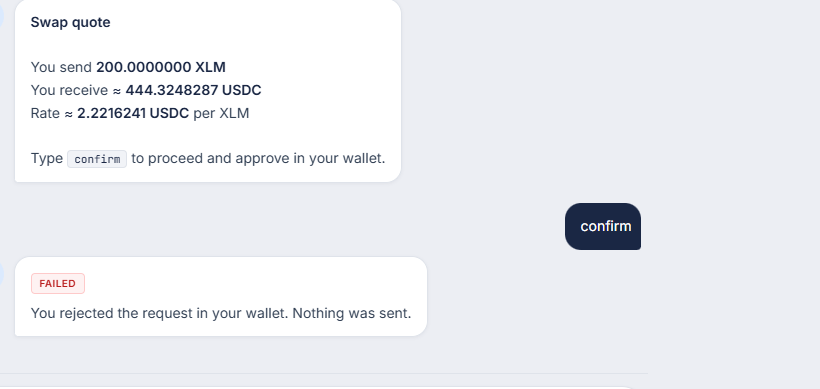
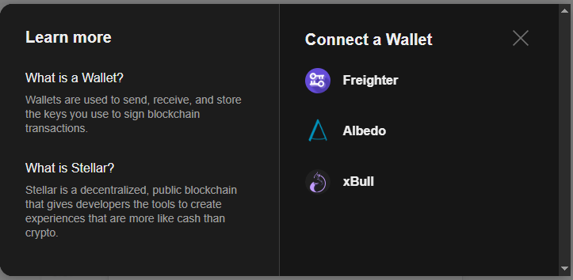

# StellarChat Pay

Send XLM payments through a chat interface on the **Stellar testnet**. Built for the RiseIn Stellar Developer Challenge.

**Live demo:** [https://stellarchatpay.vercel.app/](https://stellarchatpay.vercel.app/)

Instead of traditional forms, you connect a Stellar wallet and type commands like `send 10 to G...` to move testnet XLM. Payments can be logged to a Soroban contract with a live activity feed in chat.

---

## Level 1 — White Belt (complete)

- Freighter wallet connect/disconnect on testnet
- Balance display + send XLM
- Transaction success/failure with hash

## Level 2 — Yellow Belt (complete)

- **StellarWalletsKit** — pick Freighter, Albedo, or xBull from a wallet modal
- **Soroban contract** — `payment-log` records payments and emits events
- **Real-time feed** — `activity` command + live event polling in chat
- **Error handling** — wallet not found, user rejected, insufficient balance

---

## Features

- **Multi-wallet connect** via StellarWalletsKit
- **Live XLM balance** in the header after connecting
- **Any-wallet balance lookup** — `balance G...`
- **Friendbot funding** — `fund` or `fund G...`
- **Chat-based payments** — send XLM with natural commands
- **DEX swaps in chat** — swap XLM ↔ USDC via path payments on testnet
- **On-chain activity log** — Soroban contract + event feed
- **Transaction feedback** — pending / success / failure with explorer links

## Chat Commands

| Command | Description |
|---------|-------------|
| `help` | Show all available commands |
| `balance` | Display your current XLM balance |
| `balance G...` | Check balance of any testnet wallet |
| `fund` | Friendbot funding for your wallet |
| `fund G...` | Friendbot funding for any address |
| `activity` | Recent payments from the Soroban contract |
| `trust usdc` | Add USDC trustline (required before swapping to USDC) |
| `swap 10 xlm to usdc` | Swap XLM → USDC via Stellar path payment |
| `swap 1 usdc to xlm` | Swap USDC → XLM |
| `balance usdc` | Show your USDC balance |
| `send 10 to G...` | Send XLM (also logged on-chain when contract is configured) |
| `pay 5 G...` | Alias for send |

## Tech Stack

- React 18 + TypeScript + Vite
- Tailwind CSS
- [@creit.tech/stellar-wallets-kit](https://www.npmjs.com/package/@creit.tech/stellar-wallets-kit) — multi-wallet
- [@stellar/stellar-sdk](https://www.npmjs.com/package/@stellar/stellar-sdk) — Horizon + Soroban RPC
- Rust Soroban contract — `contracts/payment-log`

## Prerequisites

1. [Node.js](https://nodejs.org/) 18+
2. A Stellar wallet (Freighter, Albedo, or xBull) on **Testnet**
3. [Stellar CLI](https://developers.stellar.org/docs/tools/cli) — to deploy the contract

## Setup (Local)

```bash
git clone https://github.com/thestatisticia/stellarchatpay.git
cd stellarchatpay
npm install
cp .env.example .env.local
npm run dev
```

### Deploy the Soroban contract

See [contracts/README.md](contracts/README.md). After deploy, set `VITE_CONTRACT_ID` in `.env.local` and Vercel.

## Usage

1. Click **Connect Wallet** and choose Freighter, Albedo, or xBull
2. Type `fund` if the account is new
3. Send: `send 1 to GABCDEF...`
4. Approve the XLM payment, then approve the contract `log_payment` call
5. Type `activity` to see the on-chain payment feed

## Error handling (Yellow Belt)

The three required Level 2 error types:

| Error | Trigger | User sees |
|-------|---------|-----------|
| **Wallet not found** | User picks Freighter/xBull from the modal but the extension is not installed | `Wallet not found: xBull is not installed. Download it from https://xbull.app first…` |
| **User rejected** | User cancels / declines signing in the wallet | `You rejected the request in your wallet. Nothing was sent.` |
| **Insufficient balance** | Send or swap amount exceeds balance | `Insufficient XLM balance. You have … but need at least …` |

Wallets stay listed in the picker (Freighter, Albedo, xBull). Missing wallets are not hidden — clicking one that is not installed returns the **wallet not found** error in chat.

### User rejected (screenshot)



### Insufficient balance (swap example)

```
User: swap 100000 xlm to usdc
Bot:  Insufficient XLM balance. You have 19990.9898747 XLM but need at least 100000.00001 XLM.
```

### Invalid recipient address (extra)

```
User: send 100 xlm to GAADWVWIJMANHJM7VZYVPNFLOYN7EH2FH6NJKUVTGMPKZ...
Bot:  Address looks truncated — don't use `...`. Paste the full 56-character Stellar address from your wallet.
```

## Build for Production

```bash
npm run build
npm run preview
```

## Deploy

**Live app:** [https://stellarchatpay.vercel.app/](https://stellarchatpay.vercel.app/)

1. Push to GitHub
2. Import on [Vercel](https://vercel.com)
3. Set `VITE_CONTRACT_ID` environment variable after deploying the contract

## Contract (Yellow Belt)

| Field | Value |
|-------|-------|
| **Contract ID** | `CDPSWMZ4HUBU3PX226FUPFKIXYMWFGM3U3WXD7VBYQ2IORZBXXCIJ2OX` |
| **Deploy tx** | [2186cfb1…](https://stellar.expert/explorer/testnet/tx/2186cfb1d919bf260f3fbe1ad5178de75a717391d42399b395fcb5c397b05e04) |
| **Contract call tx** (`log_payment`) | [f9b9753e…](https://stellar.expert/explorer/testnet/tx/f9b9753eb44aff2c0548e709d3f09168a843ca72786a390b1cbb7f73159f25b0) |
| **Network** | Stellar Testnet |

Set `VITE_CONTRACT_ID=CDPSWMZ4HUBU3PX226FUPFKIXYMWFGM3U3WXD7VBYQ2IORZBXXCIJ2OX` in Vercel and redeploy.

## Screenshots

### Wallet connected + balance in header


### Balance check via chat


### Successful XLM payment


### Error handling — insufficient balance


### Error handling — user rejected


### Multi-wallet picker modal



## Submission Checklist

### White Belt — complete

- [x] Freighter + testnet, connect/disconnect, balance, send XLM, tx hash
- [x] [GitHub repo](https://github.com/thestatisticia/stellarchatpay) + [live demo](https://stellarchatpay.vercel.app/)

### Yellow Belt

- [x] StellarWalletsKit multi-wallet
- [x] 3 error types handled
- [x] Soroban contract source (`contracts/payment-log`)
- [x] Contract called from frontend after payments
- [x] Real-time event polling + `activity` command
- [x] Transaction status (pending / success / fail)
- [x] Contract deployed on testnet (`VITE_CONTRACT_ID` set)
- [x] Contract address + deploy tx hash in README
- [x] Contract call tx hash in README (`log_payment`)
- [x] Screenshot: wallet options modal
- [x] 2+ meaningful commits on same repo

## License

MIT
