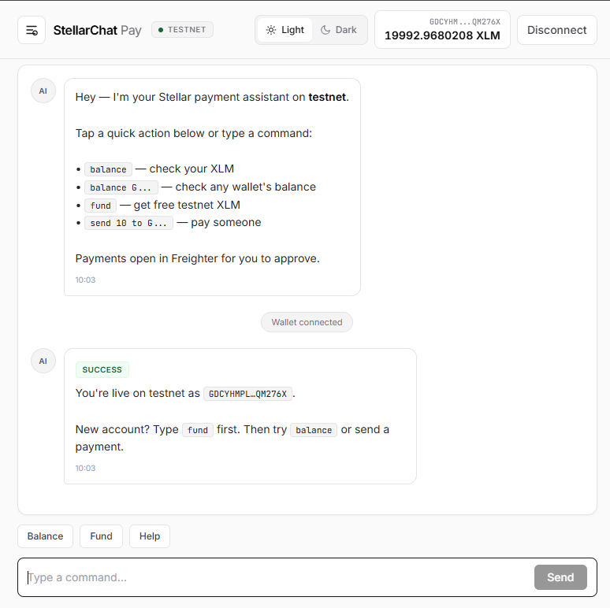
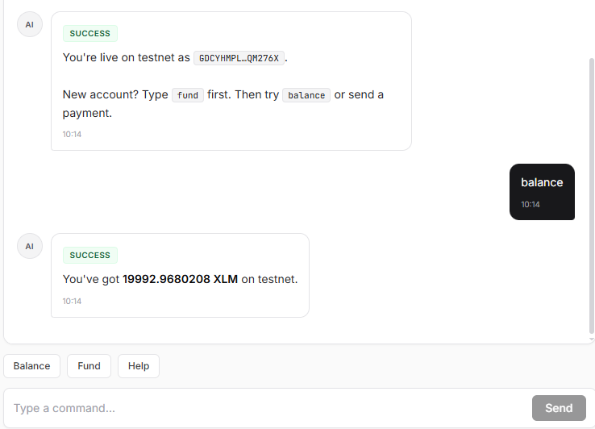
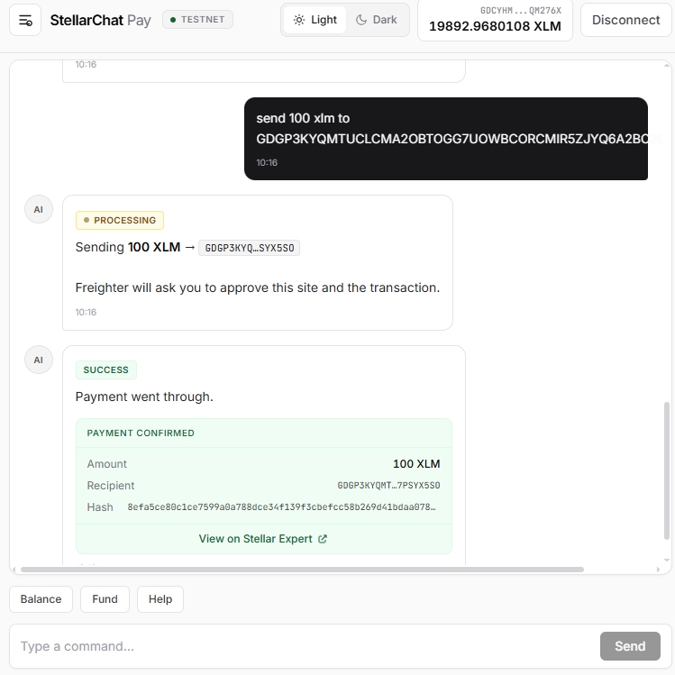
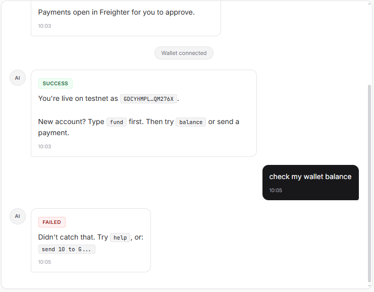

# StellarChat Pay

Send XLM payments through a chat interface on the **Stellar testnet**. Built for the RiseIn White Belt challenge.

**Live demo:** [https://stellarchatpay.vercel.app/](https://stellarchatpay.vercel.app/)

Instead of traditional forms, you connect your Freighter wallet and type commands like `send 10 to G...` to move testnet XLM. The app handles wallet connection, balance display, and transaction feedback inline in the conversation.

## Features

- **Freighter wallet** connect and disconnect on Stellar testnet
- **Live XLM balance** in the header after connecting
- **Any-wallet balance lookup** — check any testnet address via chat
- **Chat-based payments** — send XLM with natural commands
- **Friendbot funding** — type `fund` to get testnet XLM for new accounts
- **Transaction feedback** — success/failure states with hash and Stellar Expert link

## Chat Commands

| Command | Description |
|---------|-------------|
| `help` | Show all available commands |
| `balance` | Display your current XLM balance |
| `balance G...` | Check balance of any testnet wallet |
| `check G...` | Alias for balance lookup |
| `fund` | Request free testnet XLM from Friendbot |
| `send 10 to G...` | Send XLM to a Stellar address |
| `pay 5 G...` | Alias for send |
| `transfer 2 XLM to G...` | Alias for send |

## Tech Stack

- React 18 + TypeScript + Vite
- Tailwind CSS
- [@stellar/freighter-api](https://www.npmjs.com/package/@stellar/freighter-api) — wallet integration
- [@stellar/stellar-sdk](https://www.npmjs.com/package/@stellar/stellar-sdk) — Horizon API & transactions

## Prerequisites

1. [Node.js](https://nodejs.org/) 18+
2. [Freighter wallet](https://www.freighter.app) browser extension
3. Freighter set to **Testnet** (Settings → Network → Testnet)

## Setup (Local)

```bash
git clone https://github.com/thestatisticia/stellarchatpay.git
cd stellarchatpay
npm install
npm run dev
```

Open [http://localhost:5173](http://localhost:5173) in your browser.

## Usage

1. Click **Connect Wallet** and approve in Freighter
2. If your account is new, type `fund` in the chat to get testnet XLM
3. Check your balance with `balance` (also shown in the header)
4. Send a payment: `send 1 to GABCDEF...` (use a real testnet address)
5. Approve the transaction in Freighter
6. See the success message with transaction hash and explorer link

## Build for Production

```bash
npm run build
npm run preview
```

## Deploy

**Live app:** [https://stellarchatpay.vercel.app/](https://stellarchatpay.vercel.app/)

This project includes a `vercel.json` for easy deployment:

1. Push to GitHub
2. Import the repo on [Vercel](https://vercel.com)
3. Deploy (no environment variables needed for testnet)

## Screenshots

### Wallet connected + balance in header



### Balance check via chat

Type `balance` to fetch and display your XLM on testnet.



### Successful XLM payment

Send command with processing state, confirmation card, transaction hash, and Stellar Expert link.



### Error handling

Unrecognized commands return clear feedback with suggested alternatives.



## Submission Checklist (White Belt)

- [x] Freighter wallet on Stellar testnet
- [x] Wallet connect functionality
- [x] Wallet disconnect functionality
- [x] Fetch and display XLM balance
- [x] Send XLM transaction on testnet
- [x] Show success/failure + transaction hash
- [x] Public GitHub repository — [thestatisticia/stellarchatpay](https://github.com/thestatisticia/stellarchatpay)
- [x] Live demo — [stellarchatpay.vercel.app](https://stellarchatpay.vercel.app/)
- [x] README with setup instructions and screenshots

## License

MIT
